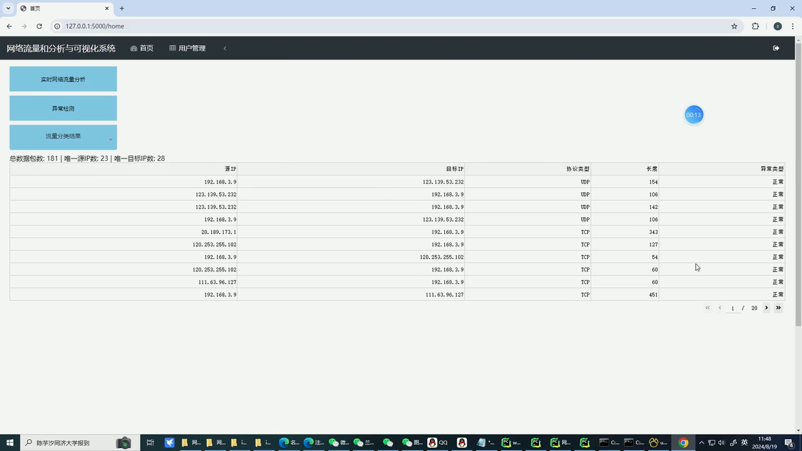

## 计算机毕业设计Python异常流量检测 流量分类 流量分析 网络流量分析与可视化系统 网络安全 信息安全 机器学习 深度学习   

## 要求
### 源码有偿！一套(论文 PPT 源码+sql脚本+教程)

### 
### 加好友前帮忙start一下，并备注github有偿异常流量检测
### 我的QQ号是2827724252或者798059319或者 1679232425或者微信:bysj2023nb

# 

### 加qq好友说明（被部分 网友整得心力交瘁）：
    1.加好友务必按照格式备注
    2.避免浪费各自的时间！
    3.当“客服”不容易，repo 主是体面人，不爆粗，性格好，文明人。

## 功能
1.网络流量捕获: 使用 Python 的网络编程库或第三方工具，如 Scapy，实时监听网络接口，捕获网络数据包。
2.流量分析: 设计流量分析算法，利用网络数据包中的关键信息，如源 IP、目标 IP、协议类型等，进行流量分类、异常检测等分析。
3.数据可视化: 使用 Python 的数据可视化库，如 Plotly、Matplotlib 等，将流量分析结果进行可视化展示，以图表、图形等形式直观呈现。

## 演示视频
https://www.bilibili.com/video/BV1yzzjYZETy/?spm_id_from=333.999.0.0

## 运行截图

